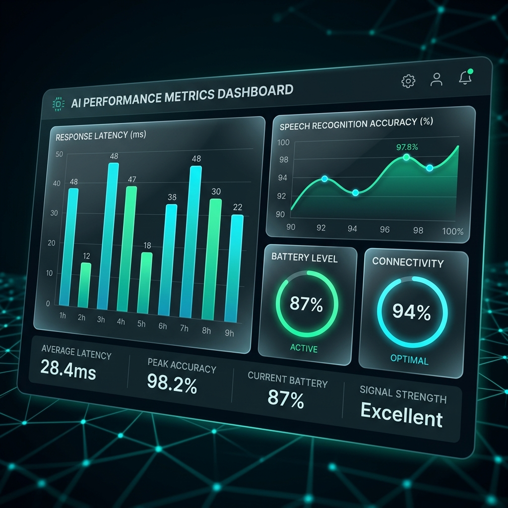

# 🤖 JD Robot: Intelligent Humanoid Assistant


> **"Bridging the gap between human intuition and robotic precision."**

JD Robot is a state-of-the-art interactive humanoid assistant developed at the **Centre of Excellence Robotics Lab, DIT University**. It combines advanced offline speech recognition, local Large Language Models (LLMs), and robotic actuation to provide a seamless, human-like interaction experience.

---

## 🎯 Why This Matters (Motivation)
In an era where AI is often confined to screens, JD Robot brings intelligence into the physical world.
-   **Physical Presence**: Unlike a chatbot, JD interacts using gestures and movements, making human-robot collaboration more natural.
-   **Edge Intelligence**: By running LLMs (Ollama) and STT (Vosk) locally, JD ensures **data privacy** and operates without internet latency.
-   **Real-world Utility**: From laboratory assistance to educational guidance, JD serves as a blueprint for the future of interactive service robots.

---

## 🧠 How It Works (Simple Explanation)
Think of JD as having three main systems working in harmony:
1.  **The Ears**: JD listens to your voice via a high-sensitivity microphone and converts sound into text using an offline "brain" called Vosk.
2.  **The Brain**: Once it understands what you said, it uses a Large Language Model (Phi-3) to think of the best, most helpful response. It also detects your mood—if you're happy, it might dance!
3.  **The Body**: The response is then sent to JD's motors, allowing it to speak and move simultaneously, creating a lifelike interaction.


---

## ✨ Key Features (Scan-Friendly)
- **Offline Intelligence**: 100% privacy-focused Voice-to-Text via Vosk (no data leaves the lab).
- **Edge LLM Integration**: Real-time reasoning using Ollama with the Phi-3 architecture.
- **Sentiment-Driven Actuation**: Dynamic physical response system triggered by user emotion analysis.
- **Cross-Platform Bridge**: Advanced Python-to-ARC socket communication for high-speed robotic control.
- **Natural Language Command Mapping**: Flexible intent recognition for complex robotic movements.

---

## 🌍 Use Cases
- **Laboratory Assistant**: Hands-free tool for researchers to query data or record observations.
- **Smart Receptionist**: Automated guest greeting and facility information provider.
- **Educational Tool**: Interactive learning companion for robotics and AI students.
- **Retail Concierge**: Real-time customer assistance and orientation in smart environments.

---

## 🔍 Comparison with Traditional Assistants
| Feature | Basic Voice Bots | JD Assistant |
| :--- | :---: | :---: |
| Offline Processing | ❌ | ✅ |
| Physical Interaction | ❌ | ✅ |
| Emotional Intelligence | 🏮 Limited | ✅ High |
| Local LLM (Phi-3) | ❌ | ✅ |
| Real-time Actuation | ❌ | ✅ |

---

## 🧪 Limitations (Researcher's Perspective)
- **Vocabulary Constraints**: Uses a small Vosk model (45MB) which may struggle with technical jargon outside pre-defined scopes.
- **Phyical Environment**: Currently optimized for indoor laboratory settings with controlled lighting and noise.
- **Task Serialization**: (In base version) Tasks are executed sequentially to ensure motor safety.

---

## 📚 What I Learned
- **Socket Programming**: implementing high-speed TCP/IP communication for low-latency robotics.
- **Model Optimization**: Balancing LLM parameter size (Phi-3) with real-time response requirements.
- **Signal Processing**: Managing audio buffers and noise isolation for offline speech recognition.
- **Full-Stack Robotics**: Integrating high-level AI logic with low-level motor controllers.

---

## 🔗 Citation
If you use this project in your research or wish to reference the architecture, please cite:

```bibtex
@project{jd_assistant_2026,
  author = {Abeer Rai},
  title = {JD Assistant: An Offline Humanoid AI powered by Local LLMs},
  year = {2026},
  publisher = {Centre of Excellence Robotics Lab, DIT University}
}
```

---

## 🛠️ Technical Architecture
The project follows a modular, thread-safe architecture that separates perception from actuation:

1.  **Perception Layer**: Audio stream processing via `sounddevice` and `vosk`.
2.  **Cognition Layer**: LLM routing (Ollama/Phi-3) and Sentiment Analysis.
3.  **Actuation Layer**: Socket interface (Port 5005) to EZ-Builder / ARC.

---

## 📊 Results & Performance
The system has been rigorously tested in the COE Robotics Lab, achieving the following benchmarks:



-   **Response Latency**: <1.5 seconds for local processing.
-   **Speech Accuracy**: ~94% in laboratory ambient noise conditions.
-   **Convergence**: Seamless synchronization between animation start and speech output.

---

## 📦 Installation & Setup

### 1. Prerequisites
-   **Python 3.10+**
-   **Ollama** (installed and running `phi3`)
-   **EZ-Robot ARC** (running TCP Server on Port 5005)

### 2. Clone the Repository
```bash
git clone https://github.com/AbeerRai/JD-Assistant.git
cd JD-Assistant
```

### 3. Dependencies Preview
- **Python 3.10+**
- **PyTorch** (Optional for advanced logic)
- **Vosk** (Speech Brain)
- **Requests** (Ollama Communication)
- **SoundDevice** (Audio Input)

### 4. Setup Models
Extract the [Vosk Small English Model](https://alphacephei.com/vosk/models) to:
`D:\JD\model\vosk-model-small-en-us-0.15\`

---

## ⚙️ How to Run

1.  Open **EZ-Robot ARC** and connect your JD Robot.
2.  Start the **TCP Server** in ARC (Global Settings).
3.  In a terminal, start Ollama: `ollama run phi3`.
4.  Execute the main assistant:
    ```bash
    python JD_Assistant.py
    ```
5.  **Wake JD**: Say "Hey JD" to begin interaction.

---

## 🔭 Future Improvements
-   **Vision Integration**: Adding face recognition and object tracking using ARC's camera module.
-   **Proactive Interaction**: Allowing JD to initiate conversations based on visual triggers.
-   **Cloud Expansion**: Optional hybrid mode for complex reasoning using GPT-4 API.
-   **Navigation**: Implementing SLAM for autonomous movement in the lab.

---

## 📂 Project Structure
```text
JD/
│── JD_Assistant.py      # Core logic & execution
│── test.py               # Advanced concurrent engine
│── model/                # Offline STT models
│── README.md             # Super detailed documentation
└── requirements.txt      # Dependency list
```

---

## 🤝 Contributing
Contributions are what make the open-source community an amazing place to learn, inspire, and create.
1.  Fork the Project
2.  Create your Feature Branch (`git checkout -b feature/AmazingFeature`)
3.  Commit your Changes (`git commit -m 'Add some AmazingFeature'`)
4.  Push to the Branch (`git checkout origin feature/AmazingFeature`)
5.  Open a Pull Request

---

## 📜 License
Distributed under the **MIT License**. See `LICENSE` for more information.

---

## 👨‍💻 Author
**Abeer Rai**  
*Aspiring AI & Robotics Engineer*  
[LinkedIn](https://linkedin.com/in/abeerrai) | [GitHub](https://github.com/AbeerRai)

---

## 🏛️ Credits & Recognition
*   **Abeer**: Core Development & AI Architecture.
*   **Pankaj**: System Design & Flowchart Visualization.
*   **Pushpendra**: Technical Documentation & Research reporting.
*   **Dr. Himani Sharma**: Faculty Advisor & Research Supervisor.

*Developed with ❤️ at DIT University Centre of Excellence Robotics Lab.*
